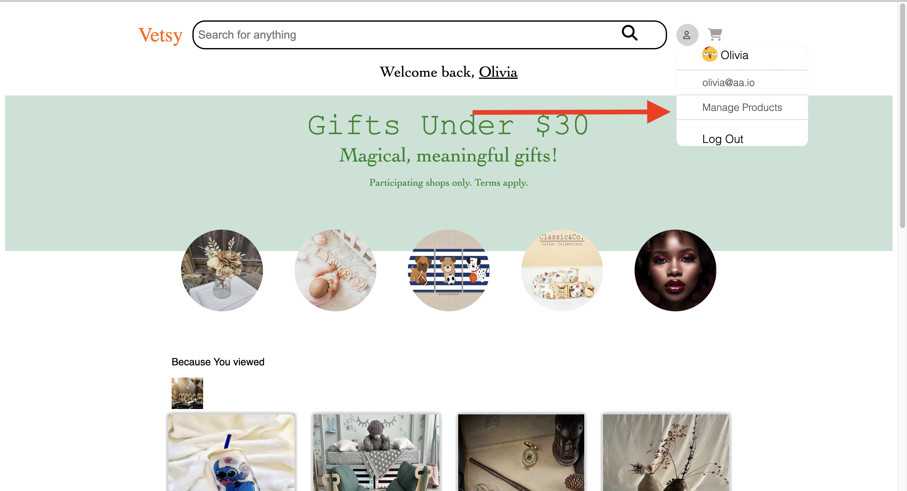
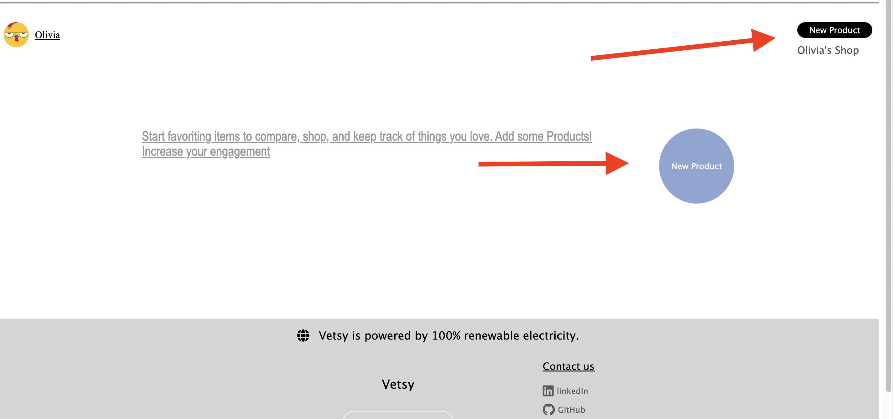
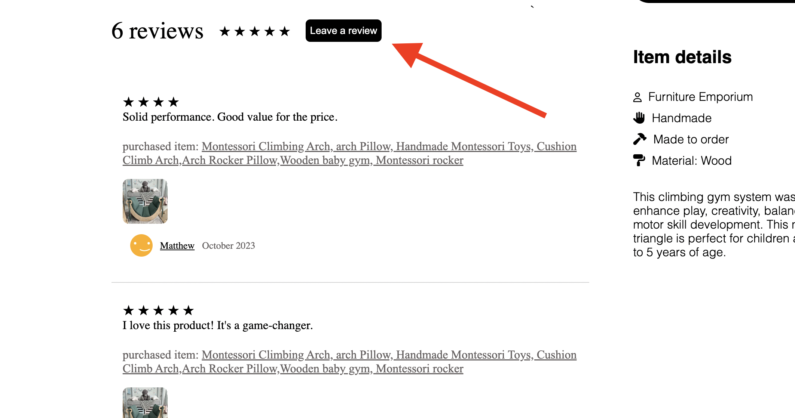
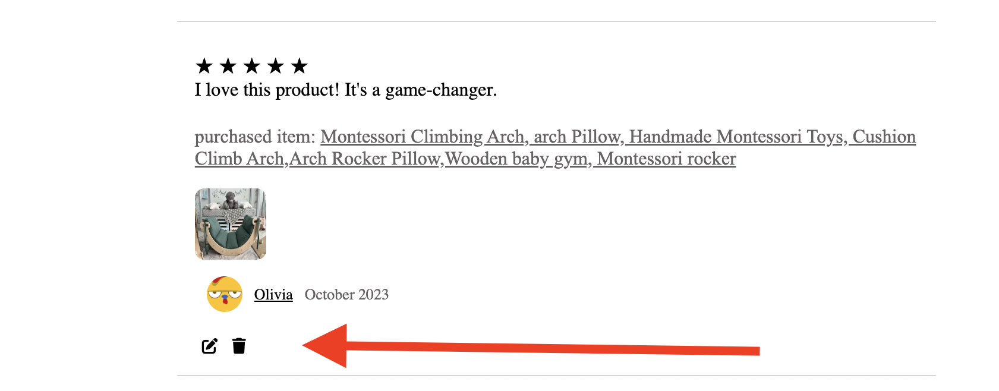
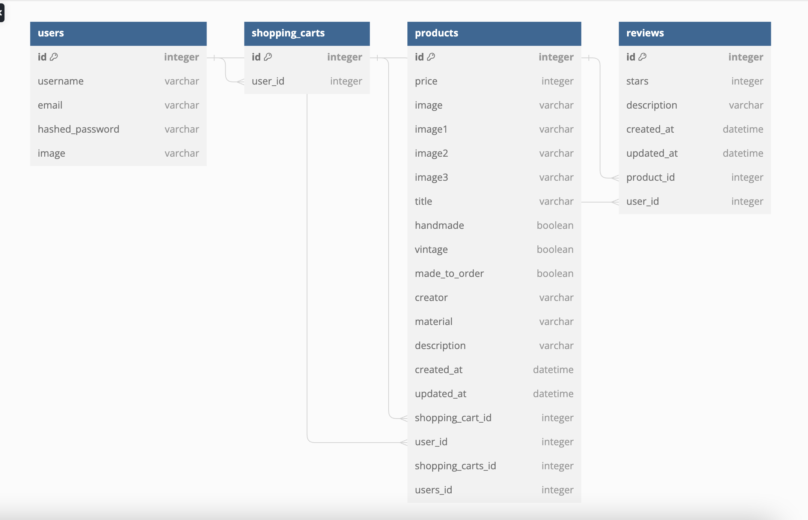

# Vetsy - Mock Etsy App
## [View the Etsy Project](https://etsyproject.onrender.com/)
Vetsy is a mock Etsy-like application that allows you to perform various actions related to an online marketplace. With Vetsy, you can search for products, create, update, and delete products, manage product reviews, add items to your cart, and more.

## Table of Contents

1. [Features](#features)
2. [Installation](#installation)
3. [Usage](#usage)
4. [Contributing](#contributing)
5. [License](#license)

## Features

### 1. Product Search

- Use the search feature to find products in the store.
- Discover a wide range of items from different categories.

### 2. Create, Update, and Delete Products
- Click on manage products after singing in as a Demo user
- Create new products and add them to your store.
- Update product information, including title, description, and price.
- Delete products you no longer want to list.

### 3. Product Reviews

- View and leave reviews for products.
- Share your experiences and feedback with other users.
- Update or delete your reviews when necessary.

### 4. Shopping Cart

- Add products to your cart while browsing.
- Review the items in your cart.
- Remove products from your cart when needed.

## Installation 
1.  **Prerequisites:**
   - git clone https://github.com/kmc369/EtsyProject.git
   

2. **Run:**
   - pipenv run flask run 
   - cd Captone-Project
   - cd react 
   - npm start
## Schema

